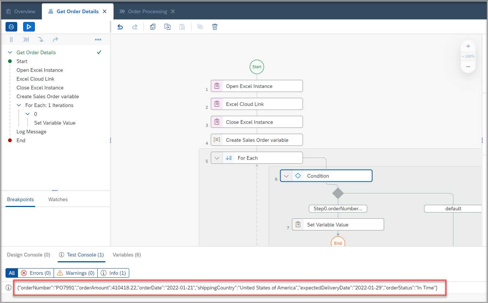

## Table of Contents
- [Table of Contents](#table-of-contents)
- [Create Automation ](#create-automation-)
- [Create Environment Variable ](#create-environment-variable-)
- [Building Automation with Activities,Controls and Data ](#building-automation-with-activitiescontrols-and-data-)
  - [Open Excel Instance ](#open-excel-instance-)
  - [Excel Cloud Link ](#excel-cloud-link-)
  - [Close Excel Instance ](#close-excel-instance-)
  - [Add Input/Output Parameters ](#add-inputoutput-parameters-)
  - [Creating Variable ](#creating-variable-)
  - [Looping Operation using For Each Control ](#looping-operation-using-for-each-control-)
  - [Add Condition inside For Each loop ](#add-condition-inside-for-each-loop-)
  - [Set Variable Value using Data Management Activities ](#set-variable-value-using-data-management-activities-)
- [End the loop ](#end-the-loop-)
- [Log message ](#log-message-)
- [Pass Output Parameters from Automation to Business Process ](#pass-output-parameters-from-automation-to-business-process-)
- [Mapping the Automation parameters with Form Parameters ](#mapping-the-automation-parameters-with-form-parameters-)
- [Test the Automation ](#test-the-automation-)
- [Summary ](#summary-)
- [License ](#license-)

## Create Automation 

>Automation is succession of steps to orchestrate multiple activities and applications on a local machine.

 In this excercise, you will automate the process to read the sales order details from an Excel and select the specific sales order details based on the input from the submitted form.

1. In the **Lobby** do the following:
    - Select the process **Order Processing**.
    - Click 
    - Select **Automation** > **New Automation**.

    

2. A pop up will appear to configure the Desktop  Agent version. Do the following in the pop up:
    - From the dropdown, select the version of the Desktop Agent installed on your machine.
      > It would be with suffix as **Registered**.
    - Click on **Confirm**.

   

3. A new pop-up will appear to create automation. Do the following in the pop-up:
    - Enter **Name** of the automation as **Get Order Details**.
    - Enter **Description** of your choice, if needed.
    - Click **Create**.
    > Identifier will be auto-filled.

   

   An automation **Get Order Details** will be created successfully.

   

## Create Environment Variable 
>Environment variables allow you to reuse certain information for a given environment.You use environment variables to pass parameters to automations.

Create an **Environment variable** to provide an option to dynamically enter the Excel path during the automation.

1. Select **Settings > Envirnoment Variables >Create**

    

2. In the new environment variable screen, do the following:
    - Enter the **Name** of the variable as **OrderFilePath**.
    - Click the **Type** as **String**.
    - Click on **Create**.

     

Environment variable is created successfully.

   

## Building Automation with Activities, Controls, and Data 

Double click on the automation **Get Order Details** which navigates to Design studio to build your automation.

### Open Excel Instance 

Open Excel Instance is a **mandatory** activity to use when using MS Excel. It opens an instance of MS Excel. Once you open an Excel instance, you can use other MS Excel activities.

1. To open **Excel Instance**, do the following:
    - Search for **Open Excel Instance** in **Automation Details** section on the right.
    - Drag and drop the activity to the canvas.

    

### Excel Cloud Link 

Excel Data Mapping is done with the Excel Cloud Link activity.
Excel Data Mapping allows you to transform columns-based data from an Excel sheet into data that can be used in your automation. The data from the Excel sheet stays the same but the structure becomes a data type structure, making it possible to use throughout your project

1. To get the **Excel Cloud Link**, do the following:
    - Search for the activity **Excel Cloud Link** in **Automation Details**.
    - Drag and drop the activity to the canvas.
    - Select **Edit activity**.

     

2.  In the **Excel File** screen that opens up, select **Browse** and choose the **SalesOrdersDetails.xlsx** file  which is saved in your machine.(Excel is available in Pre-requisites)

    > The Excel file is mapped automatically .

    

 3. Enter the **Environment Variable** as **OrderFilePath** which is created above as the parameter value for **Workbook path**.

      

      > Design Parameters are static parameters used during the design phase of the project (hence, **Design** ) and they define workbook and worksheet used during the design of the automation in **Process Builder**.

      >Execution Parameters are dynamic parameters used in the execution of the deployed version of a project, they can be defined dynamically using: automation **Input** parameters, **Environment Variables**, value from a variable in the automation, etc..

 4. Select the button **From Excel Data**.
    > A pop up appears to create a data type. A **Sales Order** variable is needed to collect the data from the excel sheet columns. In this step, a variable is automatically created from the excel file columns.

 5. Enter the **Name** of the data type as **Sales Order** and click on **Create**.
    > Framework creates a data type with the columns of the Excel as the field names.

      

 6. Change the variable name to **Orders** in the **Output Parameters** of the **Excel Cloud Link** Activity.

      

### Close Excel Instance 

Close Excel Instance activity closes an instance of MS Excel.

To close the opened instance of the excel file, do the following:
  - Search for the activity **Close Excel Instance** in **Automation Details**.
  - Drag and drop the activity to the canvas.

**Save** the automation.

### Add Input/Output Parameters 
 Input and output parameters allow you to exchange data in the workflow of your automation between activities, screens, and scripts.

1. Click on the canvas and select the **Input/Output** section in **Automation Details**.

     

2.  Add Input and Output parameters as following:

      | Parameter Name | Data type        | Parameter Type | Description                                          |
      |:---------------|:-----------------|:---------------|:-----------------------------------------------------|
      | OrderNumber    | **`String`**     | Input          | Recieves Order number from the Order Processing Form |
      | selectedOrder  | **`SalesOrder`** | Output         | Selected Order details are passed to the Process     |

      

### Creating Variable 

Variables that are used build your automation are data storage that has a name, a type (example: string, list of string or data type), and a value. A variable in the automation is also associated to a step represented by its number.

1. Search for the **Sales Order** Data type (created in previous step) in **Automation Details**.

    

2.  Drag and drop the **Sales Order** in the canvas.
    > A variable of the data type **Sales Order** is created.
      - Enter the value of **Output Parameters** as **selectedOrderDetails**.

     

>Now,let's check if the Order Number entered in the **Form** is present in the SalesOrderDetails Excel.

### Looping Operation using For Each Control 
Now you will loop through each **Order** from the excel sheet retrieve the Order details for order number submitted in the **Order Processing Form**.

**For Each** control allows you to go through a list of members provided as input to your automation, and execute an action for each member in that list.

This control has the following loop parameters:
 - **currentMember** - The member of the list for the current loop iteration.
 - **index** - An integer that is the index of the current loop iteration, starts at 0.

- Search for the control **For Each** in **Automation Details**.
- Drag and Drop the activity to the canvas.
- Enter the value of **Set looping List** as **Orders**.

  

### Add Condition inside For Each loop 
In this condition, you will check if the Order number entered in the **Form** is available in  data read from Excel in **Step 2**.

1. Search for the activity **Condition** in Automation Details.
2. Drag and Drop the activity **inside** the **For Each** block
3. Click on  -> **Edit Formula** to add the condition.

  

4. A pop up window appears to enter condition expression.
   - > You can enter this expression manually or you can expand the **Variables** list and select the given variables to form the expression.

   **Step0.OrderNumber === Step5.currentMember.orderNumber**

  

### Set Variable Value using Data Management Activities 

If the Order number is found in Excel, i.e. the condition is **True**,set the variable using **Set Variable Value**

- Search for the activity **Set Variable Value** in **Automation Details**.
- Drag and Drop the activity to the canv

  

- In the **Set Variable Value** configuration screen on the right, do the following:
    - Enter **selectedOrder** as the **variable**
    - Enter **currentMember** as the **value**.

  

## End the loop 

Once the order number is found in the excel, use the control **End Loop**  to stop the loop.

## Log message 
Use Log message activity to print your results.
Let's use this activity to check **selectedOrderDetails** in Testing mode.

## Pass Output Parameters from Automation to Business Process 

  Apart from creating an output parameter, it is mandatory to pass the data
  through **End** step to expose the data outside the automation.

  - Click on **End**
  - In the **End** configuration screen on the right,
      - Enter **selectedOrder** as the **Output Parameter**.

  

>Make  sure to add the steps **Condition**, **Set variable value**,**End Loop** inside the **For Each** block.

**Save** the Automation.

The complete automation **Get Order Details** looks as below.  

## Mapping the Automation parameters with Form Parameters 

- Select **Get Order Details** automation in the process **Order Processing**.
- Map the input parameter **OrderNumber** of the automation  **Get Order Details**
  with the **Order Number** of **Order  Processing Form**.

  

Click on **Save** to save the **Order Processing** process.

## Test the Automation 

- Click on   button.
- Enter the parameters to test the Automation.

| Parameter     | Value                                                                  |
|:--------------|:-----------------------------------------------------------------------|
| Order Number  | Any order number which is available in SalesOrdersDetails Excel        |
| OrderFilePath | Path where the SalesOrderDetails Excel is stored in your local machine | 

Selected Order details are passed to the Process

Test Results:

1. Automation opens the SalesOrderDetails Excel.
2. Reads the Excel content.
3. Closes the Excel.
4. Loops through Excel and verifies if entered OrderNumber is available in the Excel. If the OrderNumber  is available in the Excel, it sets the Orders Details.
5.Ends the looping.
6.Prints the selected order details .

## Summary 
You have successfully created and configured the process automation for the business process.

You are now able to:
 - [x] Add Automation to business process.
 - [x] Add & configure Excel Activities.
 - [x] Create & configure ForEach loop and condition.
 - [x] Create Environment Variables.
 - [x] Define Input and output parameters.

## License 

  Copyright (c) 2022 SAP SE or an SAP affiliate company. All rights reserved. This project is licensed under the Apache Software License, version 2.0 except as noted otherwise in the [LICENSE](../LICENSES/Apache-2.0.txt) file.
