## Table of Contents
- [Adding Process condition](#section1)
- [Adding Decision](#section2)
- [Create Data Types](#section3)
- [Configure Decision](#section4)
- [Configure Decision in Process Builder](#section4)
- [Summary](#summary)

## Adding Process condition 
**Process condition** routes the business process based on certain criteria. These conditions apply an If or Else rule and the business process responds according to the rules defined as settings in the process builder.

In this section, you will learn how to use process condition in a business process to route the process towards auto-approval and one-level approval flow based on the total order value of the sales order.

1. Click the **+** and choose **Controls > Condition** from the given options.

    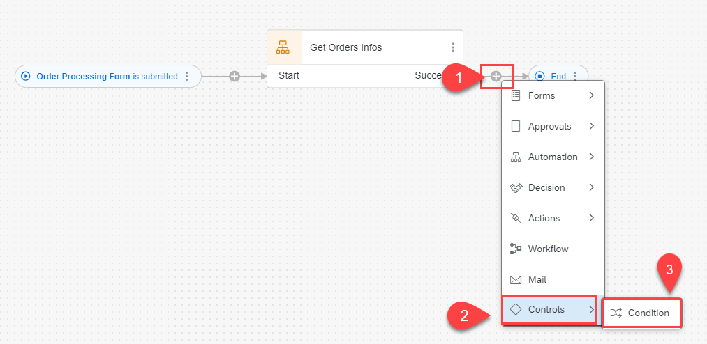

    This will add the condition to the process, and the condition configuration will open.

    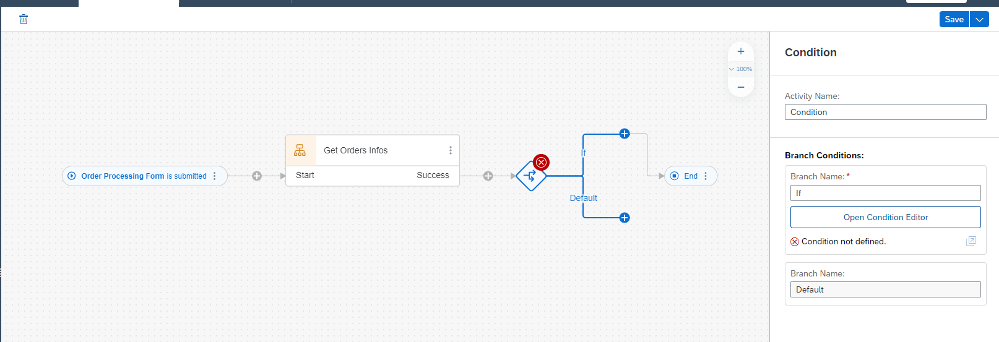

2. On the right **Condition** configuration page, click on **Open Condition Editor**. Select **Select item** text box and select **#orderAmount** from the process content.
    > Process content will contain list of attributes that have been defined in previous skills. For Example: In the screenshot, you can see attributes from the trigger form and automation. You will use these process content to configure different skills during business process modelling.

    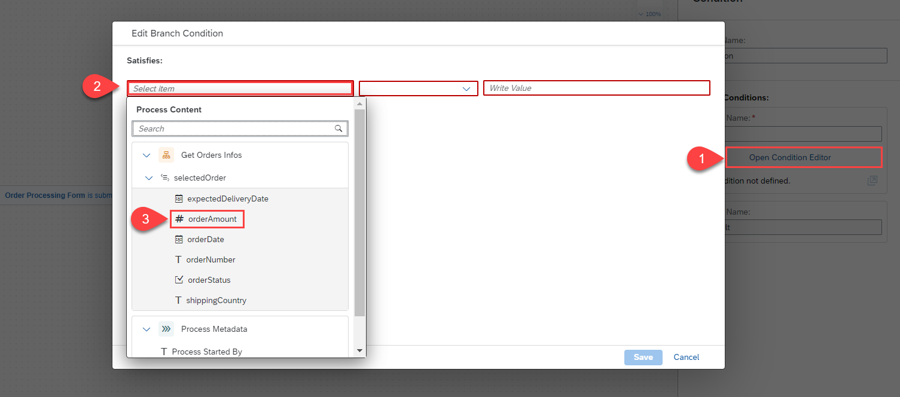

3. In the same condition configuration, select **is less than** operator and enter **100000** as the value then click **Save**.

  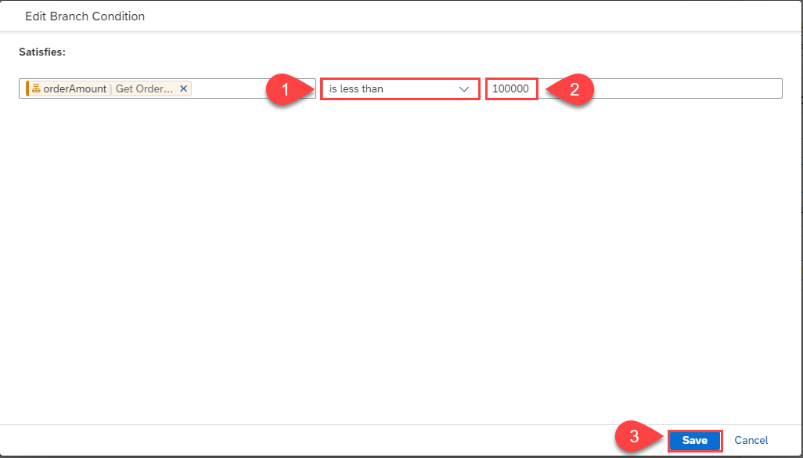

# Adding Decision 
A **decision** consists of one or more policies. Each policy consists of a collection of rules. They are used to automate the decision-making parts of a business process. After you create a decision, define your business logic by adding rules to the policy. There are two types of rules:

  - **Decision table**: A decision table is a collection of input and output rule expressions in a tabular representation.
  - **Text Rule**: A text rule is the collection of rule expressions in a simple if-then format.

**Decision Diagram** is a flow chart that describes the execution flow of the decision logic from the input to the output. Using a decision diagram, you can view the input, output, policies of a decision and the rules of the policies. You can also access each component of a decision, like a policy or a rule, via the decision diagram itself.

In this section, you will create **data types** required to configure input and output of the decision, and a decision table to determine approvers for the sales order based.

1. In the process builder, click **+** of the **else conditional flow** and select **Decision > New Decision** option.

    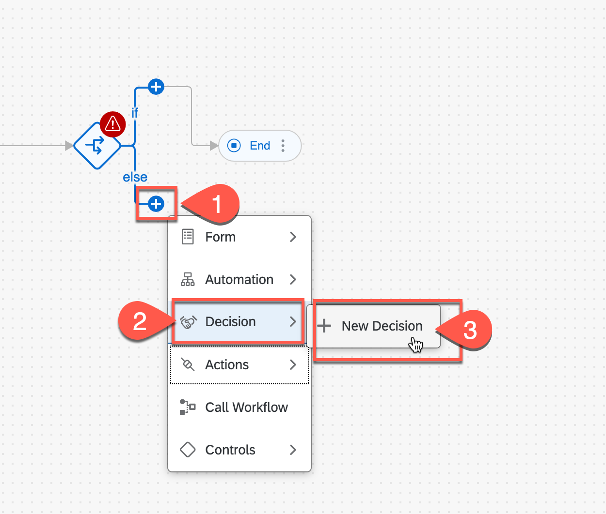

2. In the pop-up, do the following
    - Enter **Determine Approver** in the **Name** box.
    - Enter **Rule to identify the potential approvers for sales order** in the **Description** box.
    - Click **Create**.

    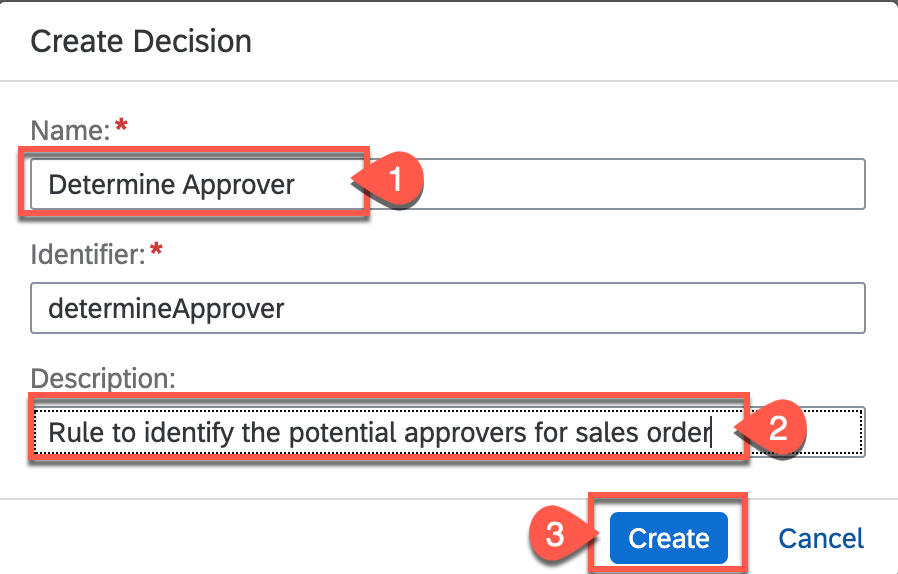

3. Now you have to model the decision. For that, click on *three-vertical-dots* on **Determine Approver** decision to open the menu and click **Open Editor**.

  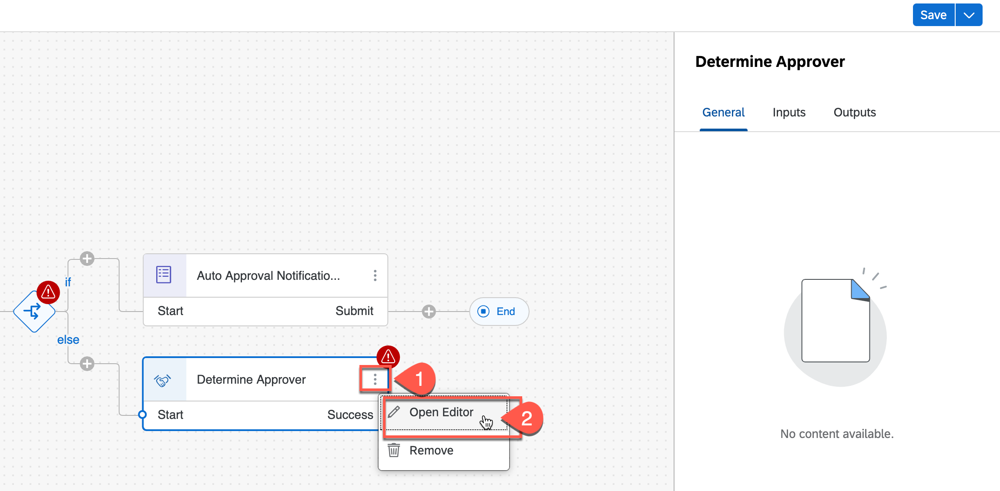

  > A decision editor opens. You can see the decision diagram on the left panel and configuration option for Input and Output on the right panel. Notice the Default policy that is pre-created with the decision.  

   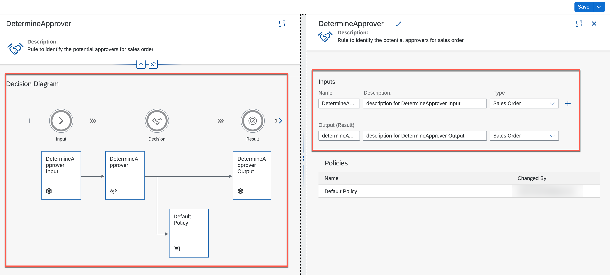

## Create Data Types 
A data type describes the data structure that can be used as an input and/or output parameter in automation, decision or processes. Data types enable you to formalize the data used as input/output parameters for steps, activities, skills processes, scenarios, triggers, or notifiers. Data types facilitate the manipulation and validation of data.

You can create a data type manually, but some data types can also be created automatically when SDK packages or pre-packaged scenarios are imported or after running an automation.

In **Get Order Details** automation, you have already generated a **Sales Order** data type. In this section, you will learn how to manually create a data type. These data types will be used as Input and Output of the decision.

1. Go to **Overview** tab, click **Create** and from available options click **Data Type**.

    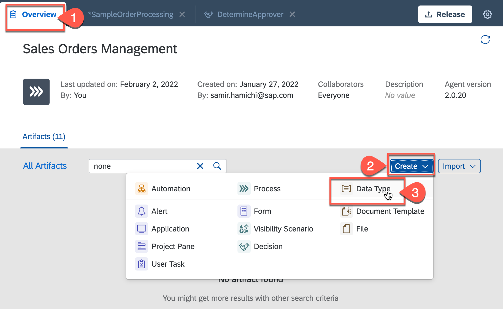

2. In the pop-up, do the following:
    - Enter **Approver** in the **Name** box.
    - Enter **Approver details who will approve the order from supplier side** in the **Description** box.
    - Click **Create**.   

    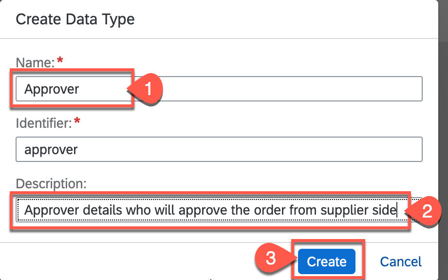

3. In the **Approver** data type screen, click **New Field** to add a new attribute to the data object.

    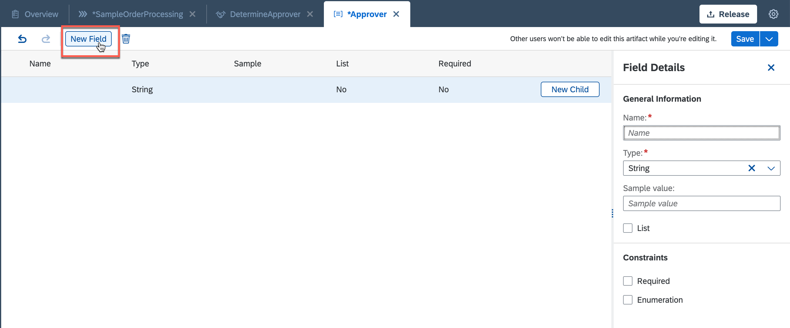

4. In the **Field Details** section on the right, Enter **Email** in the **Name** box. Keep the **Type** as **String**.
    > You can click on the **Type** dropdown list to see the different kind of data types that we support like Number, Password, Date, Time, Boolean etc.

    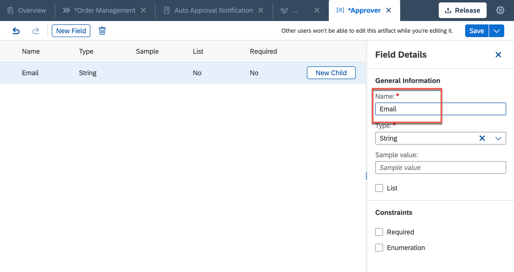

5. Similarly, add another attribute **UserGroup** of **Type** **String** to the data type.

    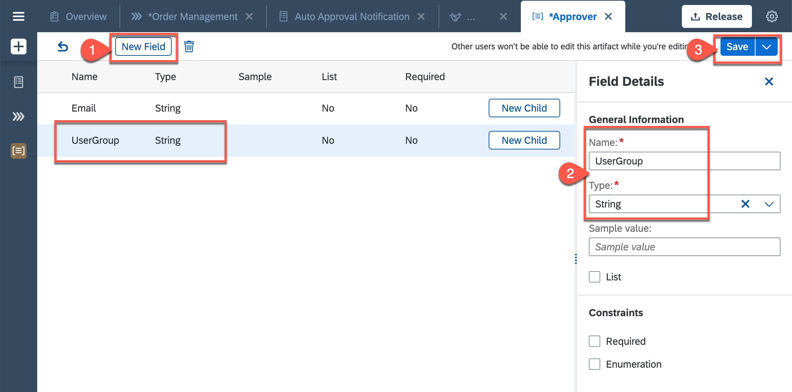

## Configure Decision 
After data types are created, you will now configure the decision :
- with Input and Output data types.
- create decision table rule to the business policy.

1. Go back to **Determine Approver** decision screen, click on **Type** options to select :
    - **Sales Order** as **Input**.
    - **Approver** as **Output (Result)**.

    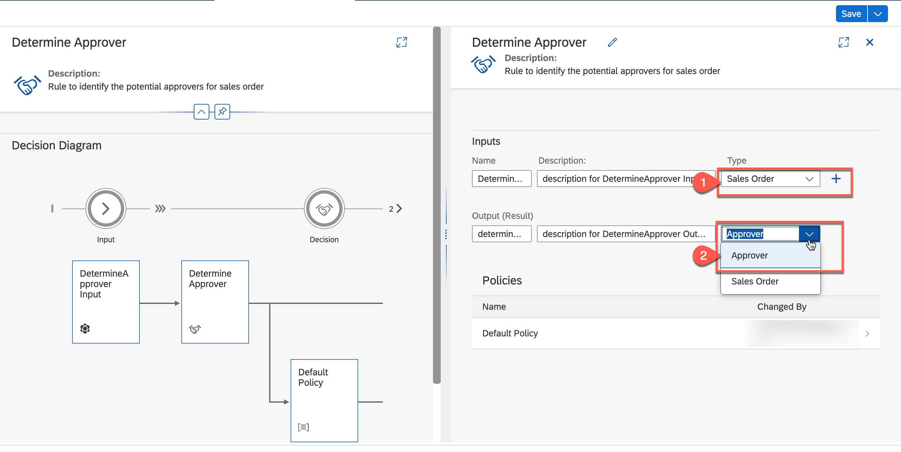

2. From left panel, click **Default Policy**, and on right panel click **Add Rule**.

    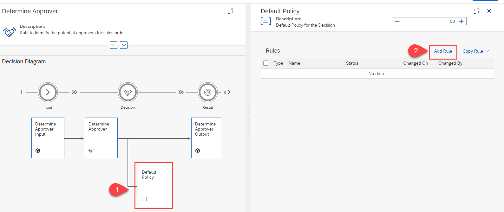

3. In the pop-up, do the following:
    - Select **Decision Table** as **Type of Rule**.
    - Enter **Determine Approver** in **Name** box.
    - Enter **Determine approver for sales order** in **Description** box.
    - Click **Add**.

    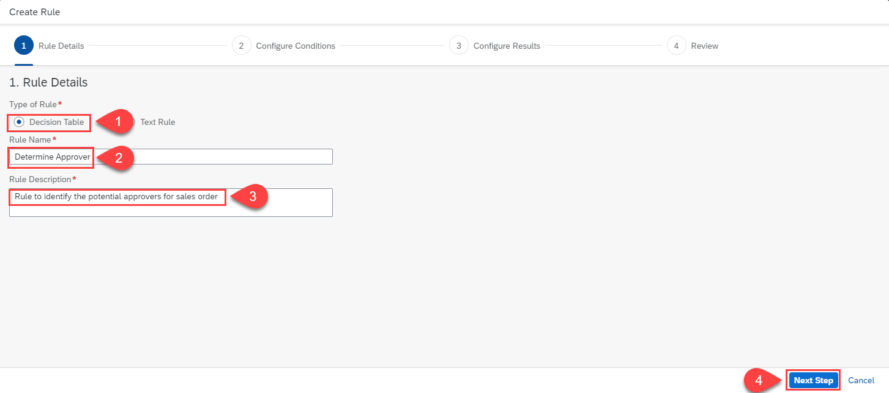

4. In **Create Rule** popup, do the following:
    > Note: As you start typing in the Condition Expression box, you will get in-place context help with the list of Vocabulary, Operators and Functions.

    - In **Data Types** input value, do the following:
      - Select **shippingCountry** and **orderAmount** from **Determine Approver Input**.
      - Click **Next Step**.
  
      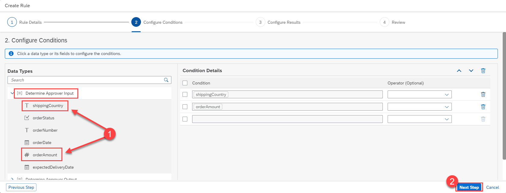

    - Select **Determine Approver Output** in **Result Datatype**.
    - Click **Determine Approver Output** to set it's attributes as **Result**.
    - Click **Next Step** to configure the decision table with selected condition and result columns.

      > You will notice *Access* column as the result properties. When you set access as *Hidden*, the respective column will not be seen during rule modelling or modifying decision table.

      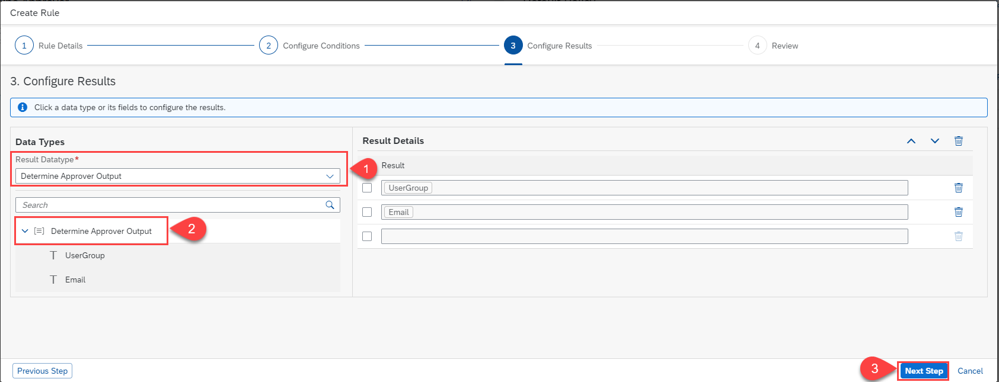

    - Further click **Create** on review step.

5. In the newly created *Decision Table*, do the following to add values to condition and result columns:

  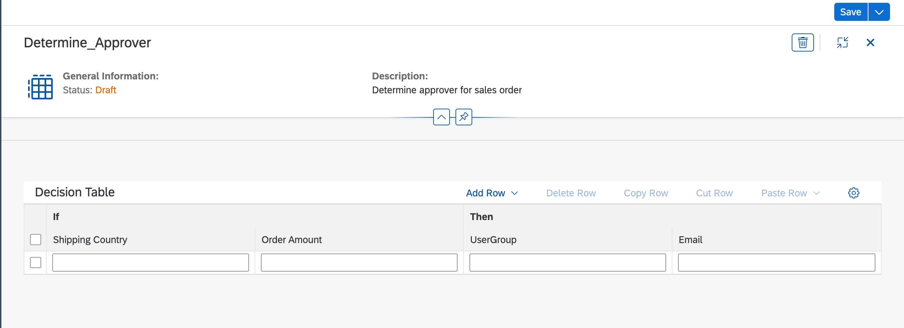

  - For the **Shipping Country** (first column) you will now add the expression value using *rule expression language*.
       -  click on the input text box.
       -  copy and paste this expression in the input box: **EXISTSIN ['United Kingdom' , 'India' , 'Germany']**
      
       
       > you can also use in-place context sensitive help to type the whole expression manually ase explained below. 
       -  start entering **exi**, and from the available operators select **EXISTS IN**.

       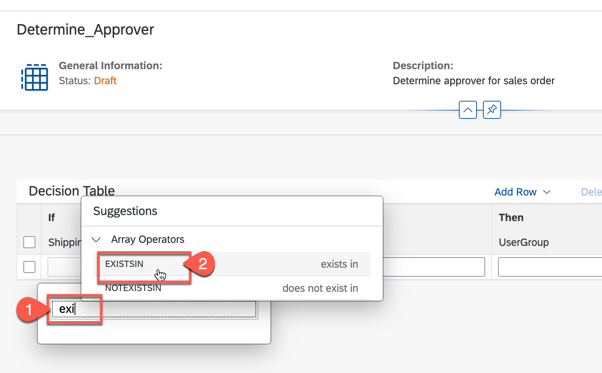

       - Continue typing, and write this expression:

      **EXISTSIN ['United Kingdom' , 'India' , 'Germany']**
      
      > You can either type-in the entire expression as free-flow or use the context help to write the expression.

      > For all *String* type of data object attribute, you have to mandatory add single-quote (') before and after the text.

    -  After you have finished, press Enter key or click outside the input field to confirm.

    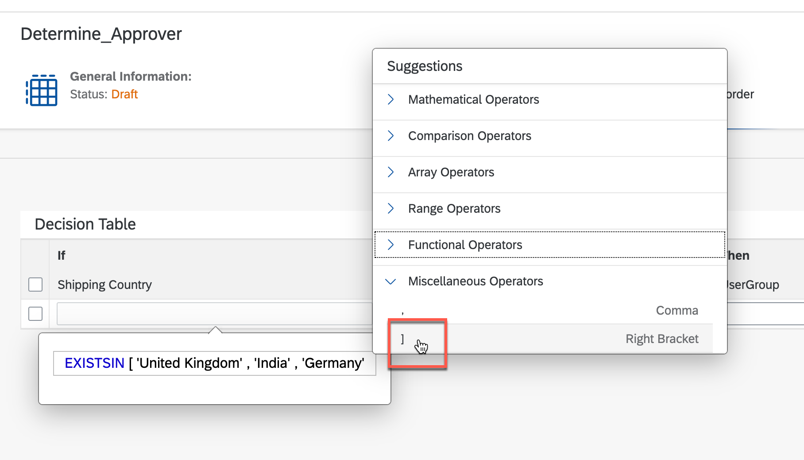

  - Click on the input field of **Order Amount** column (second column of the decision table) and enter **<= 100000**.

    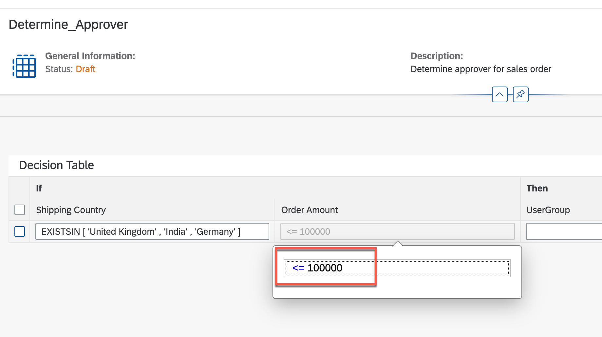

  - Similarly, enter the following expressions for the respective result column (or **Then** section):

       | Result Column | Expression |
       |---|---|
       | Email | 'your user email' |
       | User Group | 'SO_APPROVER' |

    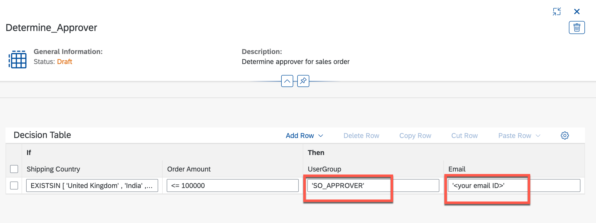

  - To add a new row to the decision table, do the following:
       - Click on the check-box of the first row.
       - Click **Add Row**.
       - From the dropdown options, click **Insert After**.

    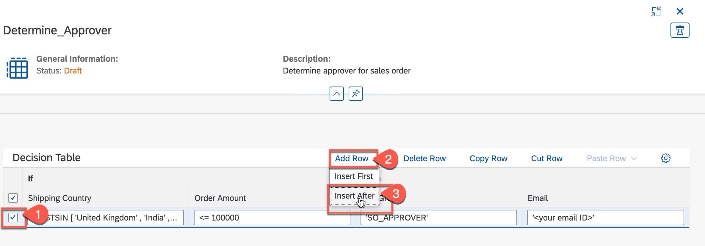    

  - Similarly, enter the following values for the new row:
    - Click **Save**
    > Save will both save and activate the decision table. If there are any validation issues in the decision table, then Save will not happen and the errors will be shown in the **Design Console**

    | Condition Column | Value |
    |---|---|
    | Shipping Country |  |
    | Order Amount | >100000 |

    | Action Column | Value |
    |---|---|
    | UserGroup | 'SO_MGMNT' |
    | Email | 'your user email' |

    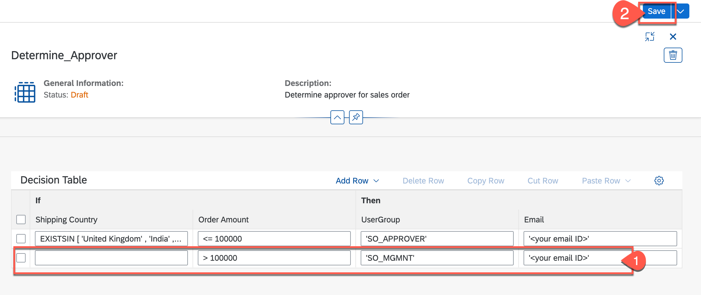

## Configure Decision in Process Builder 
After you have created and configured decision, next you have to map the input of the decision with the actual process content.

1. Open the process builder, click on **Determine Approver** decision and do the following:

    - Click on **Inputs** tab.
        > You might not see entries in the Input. This is due to a bug. As a workaround, click on the three-vertical-dot and delete the decision. Add the decision again in the process.
        
    - Map the following decision table input with the process content:

        | Decision Input Field | Process Content |
        |---|---|
        | expectedDeliveryDate | selectedOrder > expectedDeliveryDate |
        | orderAmount | selectedOrder > orderAmount |
        | orderDate | selectedOrder > orderDate |
        | orderNumber | selectedOrder > orderNumber |
        | orderStatus | selectedOrder > orderStatus |
        | shippingCountry | selectedOrder > shippingCountry |

        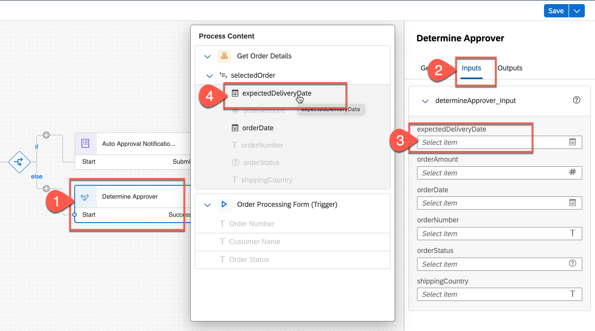  

    - **Save** the process.

        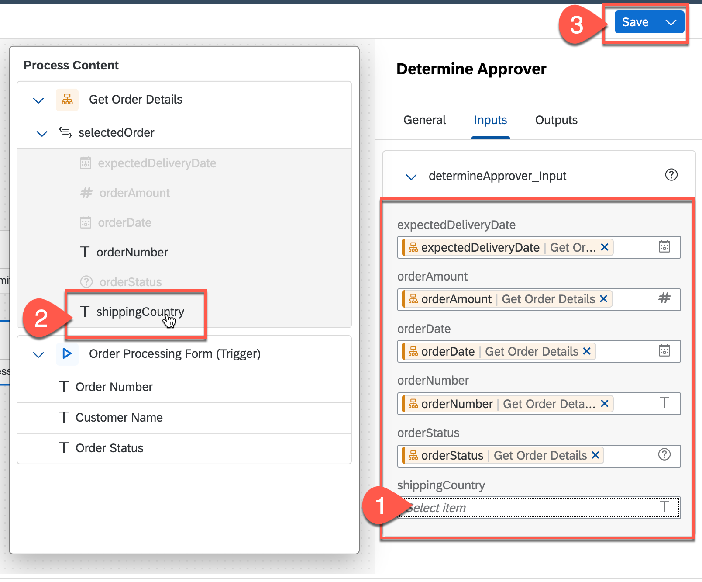

    > You might see an error symbol on your decision. This is because the outbound connection from the decision is still dangling and not connected to any activity. Proceed with your next exercise. This symbol will automatically go away once you add an approval form after this decision activitiy. 

## SUMMARY 

###### You have successfully created and configured the process condition, data type and decision for the business process.

  You are now able to:
  - [x] Add & configure Process Condition
  - [x] Create & configure Data Type
  - [x] Create & configure Decision
  - [x] Model Decision Table
