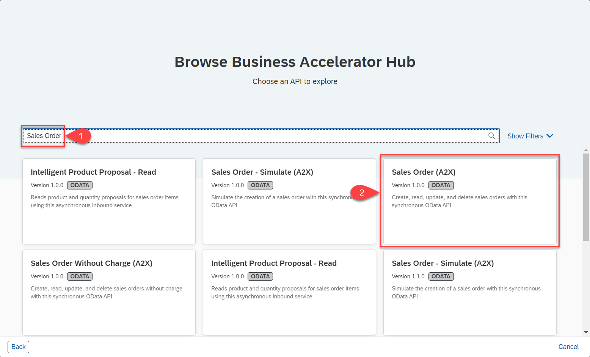
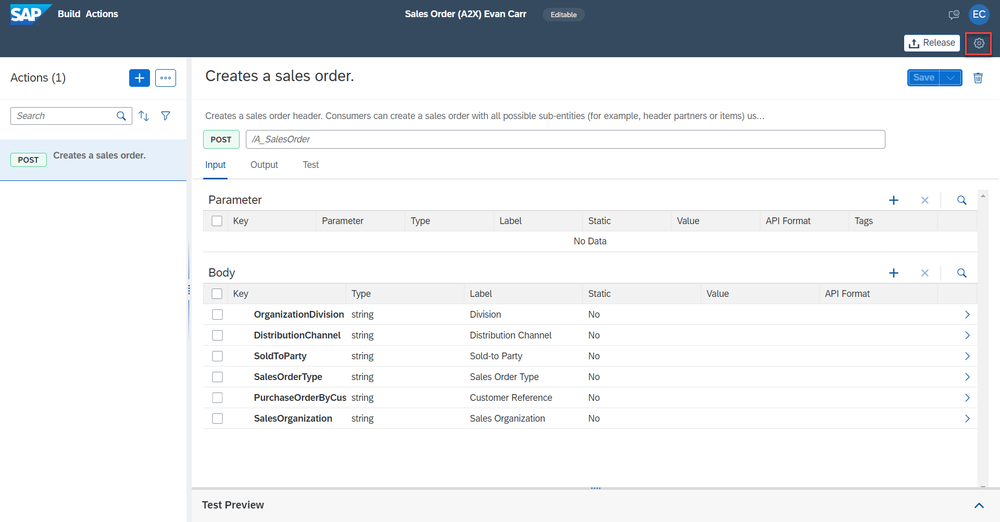

## Table of Contents
- [Adding an Action](#section1)
    - [Create and Configure the BTP Destination](#section1-destination)
    - [Create an Action Project](#section1-createproject)
    - [Configure Action Project](#section1-actionproject)
    - [Use Action from Process](#section1-actioncall)
- [Summary](#summary)

## Adding an Action 
**Actions** encapsulates APIs as actions in the business process.

Actions projects can be created in 3 different ways:
- SAP Graph allows you to consume all business data in the form of a semantically connected data graph accessed via a single unified and powerful API
- Any API specification available in the Business Accelerator Hub
- Uploading a custom API specification
    > - Only EDMX, XML, and JSON files are supported and the file size is limited to 5 MB.
    > - Open API specification files with versions 2.x.x and 3.x.x of JSON type are supported.

### Create and Configure the BTP Destination
1. An HTTP Destination was already created during the prerequisites with properties. This destination will be made available from the Build Process Automation Lobby for use in Action and Business Processes.

| Property                                    | Value  |
|:--------------------------------------------|:-------|
| sap.applicationdevelopment.actions.enabled  | true   |
| sap.processautomation.enabled               | true   |

2. Click on **Settings** in the Build Process Automation Lobby

    

3. Click on **Destinations** on the left-hand panel

    

4. Click on **New Destination**

    

5. Search for the destination and select it from the list

    

### Create an Action Project
1. In the **Lobby**, click on **Create**.

    

2. Click **Build an Automated Process**.

    

3. Click **Actions**

	

4. Click **Business Accelerator Hub**

    

5. Search for '**Sales Order**' and select '**Sales Order (A2X)**'

    

6. Click **Next**

    

7. In the pop-up, do the following:
    - Enter **Project Name** of your choice but ensure that it is unique. 
      > - If this workshop is conducted on a shared sub-account (and not on trial or free-tier) the project name has to be unique. 
      > - Suggestion: append your User Name or User ID to the project name to make it unique. For Example: Sales Order Management XYZ.
    - Edit the **Short Description** of your project, if you want.
    - Click **Create**.

    

### Configure Action Project 

1. When the Action project opens search for '**Create**', open the dropdown menu called **Sales Order Header**, and select the **POST** option with the label **/A_SalesOrder**. Add this action to the project.

    

2. In the body of the post we only want to keep the fields with the data we will use when creating the sales order. Select all fields using the checkbox at the header level of the body table and remove all fields from the table.

    

3. Add the following fields back to the Action by first clicking the plus on the body table. Then search and select the fields until all are checked. Finally, add these fields to the action.
    - OrganizationDivision
    - DistributionChannel
    - SoldToParty
    - SalesOrderType
    - PurchaseOrderByCustomer
    - SalesOrganization
    

4. Repeat steps 2 & 3 above under the Output tab until only the required fields are returned from the action
    - SalesOrder
    

5. We now want to format the full URL path to our OData service and retrieve the CSRF token required for performing a POST request. Click the settings button in the upper right hand corner

    

6. Click on the CSRF menu on the left-hand panel in the settings. Then toggle the switch to enable retrieval of the CSRF token and use the endpoint '**/$metadata**'.

    

7. Click on the URL Prefix menu on the left-hand panel and set the Resource Path to '**/sap/opu/odata/sap/API_SALES_ORDER_SRV**' and click **Save** to confirm the changes.

    

    The Destination URL, URL Prefix, CSRF End Point, and Action End Point all work in conjunction to make the API call for creating the sales order. First, the Destination URL and URL Prefix are concatenated to form the Base URL used throughout the Action project.
    > Base URL = Destination URL + URL Prefix
    
    If a request is used in the Action that intends to add, delete, or modify data, a CSRF token must first be requested. The URL used for retrieving this token is the Base URL from above and the CSRF End Point defined in the settings of the Action project.
    > CSRF URL = Base URL + CSRF End Point
    
    Finally, the Action request is made using the Base URL defined above and the Entity defined in the Action.
    > Action URL = Base URL + Action Entity

8. Now test the Action by first clicking the **Test** tab, selecting the **Destination** option, and selecting the destination imported from the dropdown menu. Proper input values must be provided to all input fields available, please use values based on your system's configuration. Click **Test** to create the sales order. The Action will return a Sales Order number if it was successful.

    

9. Click the **Release** Button in the upper right-hand corner.

    

10. Note any changes made during the release for understanding updates between releases.

    

11. Click the **Publish to Library** button in the upper right-hand corner.

    

12. Click **Publish** to confirm to make the project available in the library.

    

### Use Action from Process 

## SUMMARY 

###### You have successfully created and configured the action. This API call will create the Sales Order in the S/4HANA system.

  You are now able to:
  - [x] Create and use a Destination with SBPA.
  - [x] Create and customize Action projects.
  - [x] Call API's from a process via Actions.
