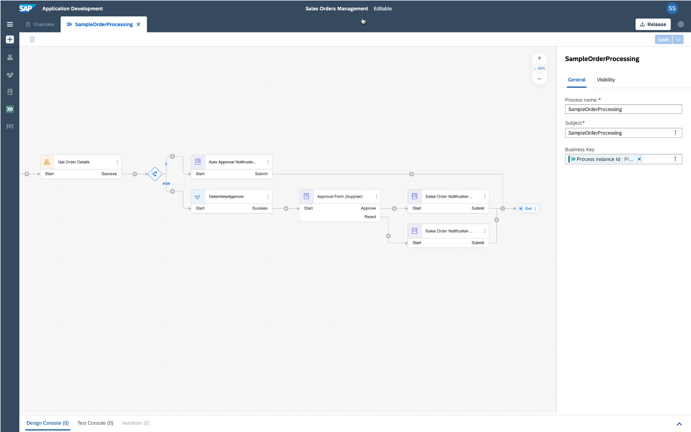

## SAP Build Process Automation - Workshop 1

In this workshop you will gain a basic understanding of SAP Build Process Automation.
While creating a sales order management process you will learn the following topics:

0. [Onboarding and Installation]() - setup your landscape
1. [The Basics]() - create a process project
2. [Automation]() - create a bot
3. [Conditions and Decisions]() - maintain branches and business rules
4. [Forms]() - design forms and approval forms
5. [Visibility]() - get insights into your process
6. [Run]() - release, deploy, run, monitor and check the performance

**Short scenario description:**
Sales orders from different customers need to be handled differently based on the sales order amount. There might be a dedicated approval necessary, before the order can be placed in SAP S/4HANA.

**Before:**
- All sales orders are stored in an XLS sheet
- Employee in sales department is checking manually the status of the orders
- Urgent orders are sent via email for approval, in case they are above a certain amount
- Another XLS sheet is checked to identify the correct approvers
- Approver replies via email to the sales department
- Sales order can be placed in SAP S/4HANA

**After (with SAP Build Process Automation):**
- Employee in sales department starts the process by providing the sales order ID
- Bot is automatically extracting the correct sales order details from the XLS sheet
- Based on the amount of the order, it is either automatically approved or requires manual approval
- Decision is automatically determining the correct approvers based on sales order details
- Approver receives notification in My Inbox application and works on it
- Employee gets automatically information whether sales order is approved and ready to be created in SAP S/4HANA
- In addition, whole process can be managed and monitored using out-of-the-box visibility

Please also visit SAP Help Portal: [SAP Build Process Automation](https://help.sap.com/viewer/a331c4ef0a9d48a89c779fd449c022e7/Cloud/en-US/c20b4e77201b4cde9ce4227e21850deb.html) 

**Good luck!**
